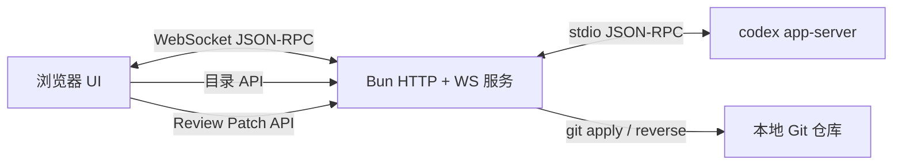

# Codex WebUI

<p align="center">
  <strong>由真实 Codex app-server 驱动、可在局域网访问的本地 WebUI。</strong>
</p>

<p align="center">
  <a href="./README.md">English</a> ·
  <a href="./CONTRIBUTING.md">贡献指南</a> ·
  <a href="./SECURITY.md">安全政策</a>
</p>

> [!IMPORTANT]
> 这是一个**非官方社区项目**，与 OpenAI 没有隶属、背书或维护关系。OpenAI、Codex 及相关标识归其各自权利人所有。

Codex WebUI 直接连接 `codex app-server --stdio`，通过响应式浏览器界面提供本地 Codex 体验。模型列表、历史会话、流式回答、工具活动、审批请求、Diff 和 Token 使用量均来自真实 app-server，而不是前端静态模拟。


## 主要功能

- 通过 WebSocket 桥接真实 `codex app-server --stdio`
- 真实模型目录、推理强度、历史 Thread 和流式 Turn
- 命令、文件修改、网络和权限审批框
- 支持 **Allow once**、**Allow similar commands** 和会话级授权
- 工具动画和执行状态由真实 item/turn 通知驱动
- Unified / Split Diff、自动换行、全部展开/收起、Undo 和 Reapply
- 安全的 Markdown、GFM、代码块、链接和 KaTeX
- 带目录边界检查的项目文件夹选择器
- Codex 风格的侧栏账号身份，支持姓名、同源代理头像 fallback 和套餐
- 长会话窗口化，避免一次渲染数千条 Turn
- 桌面与移动端响应式布局，手机端使用全屏 Review 抽屉
- 默认只监听 localhost；局域网访问需显式启用认证

## 环境要求

- [Bun](https://bun.sh/) 1.3 或更高版本
- 已安装并完成登录的 [OpenAI Codex CLI](https://www.npmjs.com/package/@openai/codex)
- Git，用于 Review 的 Undo/Reapply
- 推荐 macOS 或 Linux；Windows 尚未完整测试

如未安装 Codex CLI：

```bash
npm install -g @openai/codex
codex
```

请先完成 Codex 登录，再启动本项目。

## 快速开始

```bash
git clone https://github.com/lezi-fun/codex-webui.git
cd codex-webui
bun install
bun run start
```

本机打开：

```text
http://127.0.0.1:8899
```

默认只监听 localhost。点击 Composer 或侧栏中的文件夹按钮，即可选择 Codex 的工作目录。

## 配置

可复制示例配置：

```bash
cp .env.example .env
```

为了避免不同运行环境对 `.env` 加载方式的差异，推荐显式导出变量：

```bash
export HOST=0.0.0.0
export PORT=8899
export CODEX_WEBUI_ACCESS_TOKEN="$(openssl rand -hex 32)"
export CODEX_WEBUI_CWD="$HOME/projects/my-project"
export CODEX_WEBUI_REVIEW_ROOT="$HOME/projects/my-project"
bun run start
```

| 变量 | 默认值 | 说明 |
| --- | --- | --- |
| `HOST` | `127.0.0.1` | HTTP/WebSocket 监听地址 |
| `PORT` | `8899` | HTTP/WebSocket 端口 |
| `CODEX_WEBUI_ACCESS_TOKEN` | 未设置 | 设置后所有 HTTP/WebSocket 请求启用 Basic Auth；非 localhost 访问必须设置，用户名为 `codex` |
| `CODEX_WEBUI_CWD` | 仓库目录 | Codex 初始工作目录 |
| `CODEX_WEBUI_REVIEW_ROOT` | 与 `CODEX_WEBUI_CWD` 相同 | 允许 Undo/Reapply 的精确 Git 根目录 |
| `CODEX_HOME` | `~/.codex` | 包含 `auth.json` 的 Codex 状态目录 |
| `CODEX_AUTH_PATH` | `$CODEX_HOME/auth.json` | 可选的 Codex 认证文件精确路径 |
| `PLAYWRIGHT_EXECUTABLE_PATH` | 自动检测 | 浏览器测试可选的 Chrome/Edge 路径 |

## 安全模型

Codex WebUI 可以在本机批准执行命令和修改文件，应把它视为拥有 Shell 能力的本地开发工具。

- 不要把 `8899` 端口直接暴露到公网。
- 默认只监听 `127.0.0.1`。非 localhost 的 HTTP 和 WebSocket 请求必须提供 `CODEX_WEBUI_ACCESS_TOKEN`；Basic Auth 用户名为 `codex`，密码为该 token。
- 浏览器 RPC 使用明确白名单，无法调用 app-server 的 `fs/*`、`config/*` 或账号方法。
- 静态文件使用资源白名单，并拒绝所有符号链接。
- 文件夹浏览会 canonicalize 路径，拒绝通过 symlink 逃逸用户 Home 目录。
- Review Undo/Reapply 只使用服务端持有的 app-server Diff，拒绝客户端提交 `cwd`/Diff、符号链接补丁和 `.git`、`.env`、`node_modules` 等敏感目标。
- 允许命令前认真阅读审批内容。
- 账号身份由 app-server 的 `account/read` 与 Codex 已登录的 profile endpoint 聚合，仅允许本机 localhost 直接访问；LAN 客户端显示中性的 Settings fallback。邮箱和原始头像 URL 不会暴露，头像经同源白名单代理加载，`auth.json` token 始终只留在服务端。
- 不要在 Issue、截图或公开日志中提交凭据。

漏洞报告方式见 [SECURITY.md](./SECURITY.md)。

## Review 与审批

WebUI 处理真实 app-server 请求，而不是只画一个假的审批卡：

- `item/commandExecution/requestApproval`
- `item/fileChange/requestApproval`
- `item/permissions/requestApproval`

Review 数据来自 `turn/diff/updated`。聚合 Unified Diff 会被解析为文件和 Hunk，并支持：

- Unified / Split 切换
- Word wrap
- 全部展开/收起
- Git Undo（`git apply --reverse`）
- Git Reapply（`git apply`）

Undo/Reapply 被严格限制在配置的仓库根目录中。

## 架构



主要文件：

| 路径 | 职责 |
| --- | --- |
| `server.ts` | HTTP、WebSocket、app-server 进程、目录/配置/Review API |
| `public/app.js` | 浏览器状态、RPC、Thread、审批、Activity、Review、目录切换 |
| `public/codex-surfaces.js` | 审批模型、Diff 解析、Split 对齐、Activity 摘要 |
| `public/rendering.js` | 安全 Markdown 和 KaTeX 渲染 |
| `folder-service.js` | 受限目录浏览 |
| `review-service.js` | 经过校验的 Git Undo/Reapply |
| `tests/` | 单元、集成、浏览器、移动端和真实审批测试 |

`public/app.bundle.js` 会在服务启动时自动生成，不提交到 Git。

## 测试

如果本机没有兼容的 Chrome/Edge，可安装 Playwright Chromium：

```bash
bunx playwright install chromium
```

运行可移植单元测试：

```bash
bun run test:unit
```

检查后端和浏览器 Bundle：

```bash
bun run check
```

服务运行时执行浏览器测试：

```bash
bun run test:browser
```

以下测试需要可用且已登录的 Codex：

```bash
bun run test:integration
bun run test:e2e
```

真实审批 E2E 会让 Codex 请求执行一条无害命令，等待真实审批框，点击 **Allow once**，验证执行结果并清理临时文件。

## Codex 视觉资源

为了复刻 Codex Desktop 体验，仓库当前包含从本地 Codex.app 安装中提取的品牌和动画资源。来源和状态记录在 [THIRD_PARTY_NOTICES.md](./THIRD_PARTY_NOTICES.md) 中。这些资源不属于仓库 MIT License 的授权范围；如果相关权利人提出要求，将移除或替换。

## 已知限制

- Codex app-server 协议仍在演进，不同 CLI 版本之间可能出现变化。
- 浏览器测试需要兼容的 Chromium 浏览器。
- Undo/Reapply 当前作用于完整聚合 Diff，尚不支持逐 Hunk 操作。
- 项目有意不提供公网部署认证系统。

## 参与贡献

提交 PR 前请阅读 [CONTRIBUTING.md](./CONTRIBUTING.md)。Bug 和功能建议请使用仓库中的 Issue 模板。

## 许可证

项目源码采用 [MIT License](./LICENSE)。第三方组件和可选本地资源适用各自许可证与条款，详见 [THIRD_PARTY_NOTICES.md](./THIRD_PARTY_NOTICES.md)。
