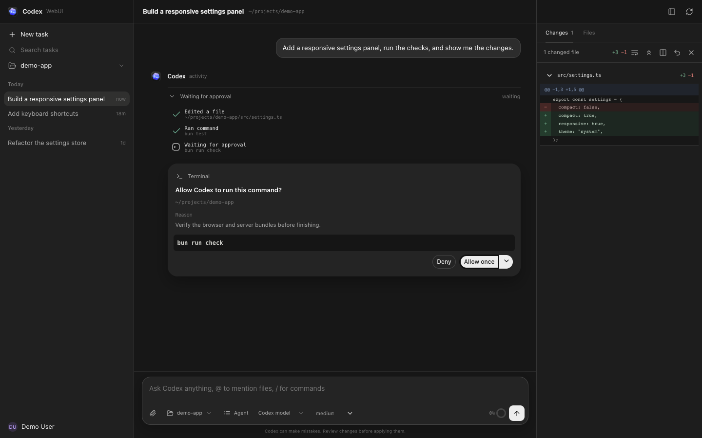
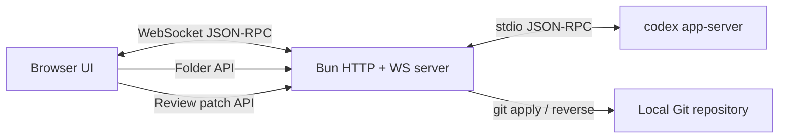

# Codex WebUI

<p align="center">
  <strong>A local, LAN-accessible WebUI for the real Codex app-server.</strong>
</p>

<p align="center">
  <a href="./README-zh.md">简体中文</a> ·
  <a href="./CONTRIBUTING.md">Contributing</a> ·
  <a href="./SECURITY.md">Security</a>
</p>

> [!IMPORTANT]
> This is an **unofficial community project**. It is not affiliated with, endorsed by, or maintained by OpenAI. OpenAI and Codex are trademarks of their respective owners.

Codex WebUI connects directly to `codex app-server --stdio` and exposes the local Codex experience through a responsive browser interface. It keeps real threads, models, streaming responses, tool activity, approval requests, diffs, and token usage instead of simulating them in a static frontend.



## Highlights

- Real `codex app-server --stdio` bridge over WebSocket
- Real model catalog, reasoning effort options, threads, and streaming turns
- Command, file-change, network, and permission approval surfaces
- Approval scopes such as **Allow once**, **Allow similar commands**, and session-level approval
- Tool activity states driven by real item/turn notifications
- Unified and split diff review, word wrap, expand/collapse, Undo, and Reapply
- Safe Markdown, GFM, fenced code blocks, links, and KaTeX rendering
- Project-folder picker with restricted filesystem browsing
- Codex-style sidebar account identity with display name, avatar fallback, email, and plan
- Long-thread windowing to avoid rendering thousands of turns at once
- Responsive desktop and mobile layouts, including a full-screen mobile review drawer
- LAN access through `0.0.0.0:8899`

## Requirements

- [Bun](https://bun.sh/) 1.3 or newer
- [OpenAI Codex CLI](https://www.npmjs.com/package/@openai/codex), installed and authenticated
- Git, for Review Undo/Reapply
- macOS or Linux recommended; Windows has not been fully tested

Install Codex CLI if needed:

```bash
npm install -g @openai/codex
codex
```

Complete the Codex sign-in flow before starting this project.

## Quick start

```bash
git clone https://github.com/lezi-fun/codex-webui.git
cd codex-webui
bun install
bun run start
```

Open:

```text
http://127.0.0.1:8899
```

The server also prints detected LAN addresses, for example:

```text
LAN: http://192.168.x.x:8899
```

Use the folder button in the composer or sidebar to select the project Codex should work in.

## Configuration

Copy the example file if you want custom settings:

```bash
cp .env.example .env
```

Bun does not automatically load every `.env` convention in all execution contexts, so exporting variables explicitly is the most predictable option:

```bash
export HOST=0.0.0.0
export PORT=8899
export CODEX_WEBUI_CWD="$HOME/projects/my-project"
export CODEX_WEBUI_REVIEW_ROOT="$HOME/projects/my-project"
bun run start
```

| Variable | Default | Description |
| --- | --- | --- |
| `HOST` | `0.0.0.0` | HTTP/WebSocket bind address |
| `PORT` | `8899` | HTTP/WebSocket port |
| `CODEX_WEBUI_CWD` | repository directory | Initial Codex working directory |
| `CODEX_WEBUI_REVIEW_ROOT` | `CODEX_WEBUI_CWD` | Exact Git root allowed for Undo/Reapply |
| `CODEX_HOME` | `~/.codex` | Codex state directory containing `auth.json` |
| `CODEX_AUTH_PATH` | `$CODEX_HOME/auth.json` | Optional explicit Codex authentication file path |
| `PLAYWRIGHT_EXECUTABLE_PATH` | auto-detected | Optional Chrome/Edge path for browser tests |

## Security model

Codex WebUI can approve command execution and file changes on your machine. Treat it like a local developer tool with shell access.

- Do **not** expose port `8899` directly to the public Internet.
- Use a trusted LAN, VPN, or authenticated reverse proxy.
- Read approval prompts before allowing commands.
- Filesystem browsing is restricted to the current user's home directory.
- Review Undo/Reapply only accepts the configured exact Git root.
- Account identity combines app-server `account/read` data with Codex's authenticated profile endpoint. `auth.json` is read only by the server; access and refresh tokens are never returned to the browser.
- Never paste credentials into issues, screenshots, or public logs.

See [SECURITY.md](./SECURITY.md) for the reporting policy.

## Review and approvals

The WebUI handles app-server requests instead of drawing fake approval cards:

- `item/commandExecution/requestApproval`
- `item/fileChange/requestApproval`
- `item/permissions/requestApproval`

Review data is driven by `turn/diff/updated`. Unified diffs are parsed into files and hunks, and the Review panel supports:

- Unified / Split view
- Word wrapping
- Expand / Collapse all
- Git-backed Undo (`git apply --reverse`)
- Git-backed Reapply (`git apply`)

Undo/Reapply is deliberately restricted to the configured repository root.

## Architecture



Main files:

| Path | Responsibility |
| --- | --- |
| `server.ts` | HTTP server, WebSocket bridge, app-server process, folder/config/review APIs |
| `public/app.js` | Browser state, RPC, threads, approvals, activity, Review, project selection |
| `public/codex-surfaces.js` | Approval models, unified-diff parsing, split alignment, activity summaries |
| `public/rendering.js` | Sanitized Markdown and KaTeX rendering |
| `folder-service.js` | Restricted directory browsing |
| `review-service.js` | Validated Git Undo/Reapply operations |
| `tests/` | Unit, integration, browser, mobile, and real approval tests |

`public/app.bundle.js` is generated automatically when the server starts and is not committed.

## Testing

Install Playwright's Chromium if you do not already have a compatible Chrome/Edge binary:

```bash
bunx playwright install chromium
```

Run the portable unit suite:

```bash
bun run test:unit
```

Check both Bun and browser bundles:

```bash
bun run check
```

With a running server:

```bash
bun run test:browser
```

Tests that require a working, authenticated Codex installation:

```bash
bun run test:integration
bun run test:e2e
```

The real approval E2E asks Codex to execute a harmless command, waits for the actual approval request, clicks **Allow once**, verifies the result, and cleans up its temporary file.

## Codex visual assets

The repository currently includes Codex-style brand and motion assets extracted from a local Codex.app installation to reproduce the desktop experience. Their source and status are documented in [THIRD_PARTY_NOTICES.md](./THIRD_PARTY_NOTICES.md). These assets are not covered by this repository's MIT license and may be removed or replaced if requested by the relevant rights holder.

## Known limitations

- The Codex app-server protocol is evolving and may change between CLI versions.
- Browser tests need a compatible Chromium browser.
- Undo/Reapply currently operates on the complete aggregated diff, not one hunk at a time.
- Authentication and public-Internet deployment are intentionally out of scope.

## Contributing

Please read [CONTRIBUTING.md](./CONTRIBUTING.md) before submitting a pull request. Bug reports and feature requests can be opened through the repository's Issue templates.

## License

Source code is available under the [MIT License](./LICENSE). Third-party components and optional local assets are covered by their own licenses and terms; see [THIRD_PARTY_NOTICES.md](./THIRD_PARTY_NOTICES.md).
